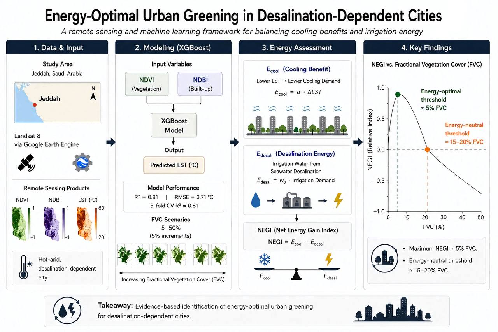

# NEGI Framework: Remote Sensing and Machine Learning for Urban Greening–Energy Assessment


An open-source implementation of the Net Energy Gain Index (NEGI) framework for evaluating urban greening under coupled water–energy–climate constraints.

---

## About

This repository accompanies the manuscript:

> **A Remote Sensing and Machine Learning Framework for Evaluating Urban Greening–Energy Trade-Offs in Desalination-Dependent Cities**



The NEGI Framework integrates Google Earth Engine, satellite remote sensing, machine learning, and comparative energy assessment to evaluate urban greening strategies in desalination-dependent cities. The repository includes the complete preprocessing workflow, Python implementation, processed datasets, scenario analysis, and sensitivity analysis required to reproduce the study.

---

# Key Results

- Optimized XGBoost achieved **R² = 0.728** with **RMSE = 1.99 °C**.
- XGBoost outperformed Linear Regression, Random Forest, and Gradient Boosting.
- Introduces the **Net Energy Gain Index (NEGI)** for evaluating urban greening under coupled cooling–energy trade-offs.
- Urban transformation (combined vegetation increase and built-up reduction) consistently outperformed greening alone.
- Maximum NEGI occurred at approximately **11% Fractional Vegetation Cover (FVC)** under the evaluated scenarios.
- Sensitivity analysis demonstrated that the optimal vegetation threshold remained relatively stable across a wide range of empirical scaling coefficients.

---

# Features

- Google Earth Engine preprocessing of Landsat 8 imagery
- Retrieval of NDVI, NDBI, Elevation, and Land Surface Temperature (LST)
- Hyperparameter optimization using GridSearchCV
- Machine learning model comparison
- Optimized XGBoost regression for LST prediction
- Feature importance analysis
- Fractional Vegetation Cover (FVC) scenario simulations
- Net Energy Gain Index (NEGI) computation
- Sensitivity analysis of NEGI parameters
- Automatic generation of publication-quality figures and CSV outputs

---

# Methodological Workflow
1. Acquire Landsat 8 imagery using Google Earth Engine.
2. Derive Normalized Difference Vegetation Index (NDVI), Normalized Difference Built-up Index (NDBI), and Land Surface Temperature (LST).
3. Extract elevation from the Digital Elevation Model (DEM).
4. Train and optimize an XGBoost regression model using GridSearchCV.
5. Benchmark XGBoost against Linear Regression, Random Forest, and Gradient Boosting models.
6. Evaluate predictive performance using cross-validation, R², RMSE, and MAE.
7. Assess the relative importance of predictor variables.
8. Simulate Fractional Vegetation Cover (FVC) scenarios under alternative urban greening strategies.
9. Estimate vegetation-induced land surface cooling.
10. Estimate irrigation energy requirements associated with desalinated water use.
11. Compute the Net Energy Gain Index (NEGI) to evaluate cooling–energy trade-offs.
12. Perform sensitivity analysis of empirical NEGI parameters to assess the robustness of the proposed framework.
---

# Repository Structure

```text
NEGI-Framework/
│
├── src/
│   └── negi_framework.py
│
├── gee/
│   └── landsat_preprocessing.js
│
├── data/
│   ├── Jeddah_NDVI_NDBI_LST_dataset_Masked.csv
│   ├── Grid_Search_Results.csv
│   ├── Model_Comparison.csv
│   ├── Scenario_Results.csv
│   ├── Scenario_Results_Formatted.csv
│   ├── NEGI_Sensitivity_Analysis.csv
│   └── Scenario_Feature_Combinations.csv
│
├── plots/
│   ├── graphical_abstract.jpg
│   ├── Figure_NDVI_Distribution.png
│   ├── Figure_NDBI_Distribution.png
│   ├── Figure_NDVI_vs_LST.png
│   ├── Figure_Actual_vs_Predicted.png
│   ├── Figure_Residuals.png
│   ├── Figure_Normalized_NEGI_Curve_Comparison.png
│   ├── Figure_Model_Comparison_R2.png
│   ├── Figure_Feature_Importance.png
│   ├── NEGI_Optimal_FVC_Sensitivity.png
│   ├── NEGI_Exponent_Sensitivity.png
│   └── Sensitivity_Maximum_NEGI.png
│
├── README.md
├── requirements.txt
├── LICENSE
├── CITATION.cff
└── .gitignore
```

---

# Installation

Clone the repository and install the required packages:

```bash
pip install -r requirements.txt
```

---

# Running the Code

Execute the complete workflow:

```bash
python src/negi_framework.py
```

The workflow automatically performs:

- Data loading
- Hyperparameter optimization
- Machine learning model comparison
- XGBoost training
- Model validation
- Feature importance analysis
- Scenario simulation
- NEGI computation
- Sensitivity analysis
- Figure generation
- Export of CSV results

---

# Outputs

The workflow generates:

- Model comparison results
- Optimized XGBoost performance metrics
- Feature importance rankings
- Scenario analysis results
- Net Energy Gain Index (NEGI)
- Sensitivity analysis outputs
- Publication-ready figures
- CSV tables for all analyses

---

# Data

The processed dataset was derived from Landsat 8 imagery using Google Earth Engine.

Each observation includes:

- Land Surface Temperature (LST)
- Normalized Difference Vegetation Index (NDVI)
- Normalized Difference Built-up Index (NDBI)
- Elevation

The processed dataset is included to enable complete reproducibility without rerunning the remote sensing workflow.

---

# Reproducibility

Executing the supplied workflow reproduces the complete analytical pipeline presented in the manuscript, including:

- Hyperparameter optimization
- Machine learning model comparison
- XGBoost model training
- Model evaluation
- Feature importance analysis
- Scenario simulations
- NEGI computation
- Sensitivity analysis
- Publication figures
- Exported result tables

---

# Citation

If this repository contributes to your research, please cite:

1. The accompanying journal article.
2. This software repository (via the included `CITATION.cff` file).

---

# License

This project is released under the MIT License.

See the `LICENSE` file for details.

---

# Contact

**Nelly F. Almaktoum**

Faculty of Computing and Information Technology (FCIT)
King Abdulaziz University  
Jeddah, Saudi Arabia

📧 nalmaktoum0001@stu.kau.edu.sa

ORCID: https://orcid.org/0009-0007-9887-0280

---

## Acknowledgement

If this repository supports your research, please consider starring the repository and citing the accompanying publication.
